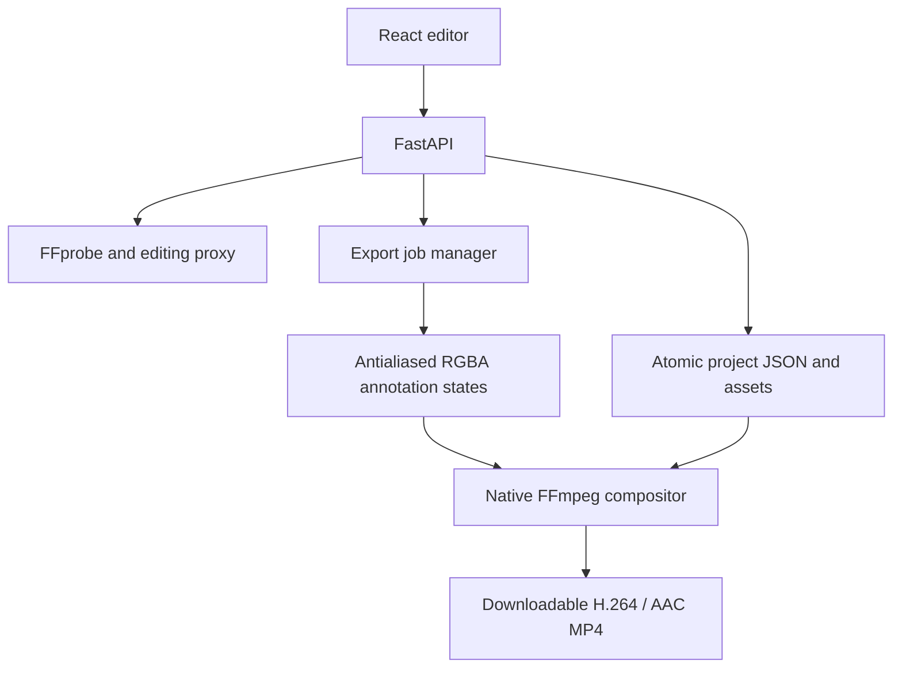
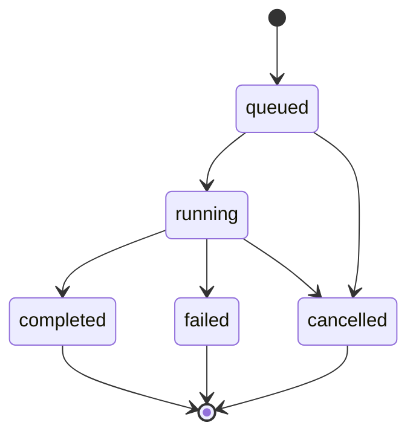
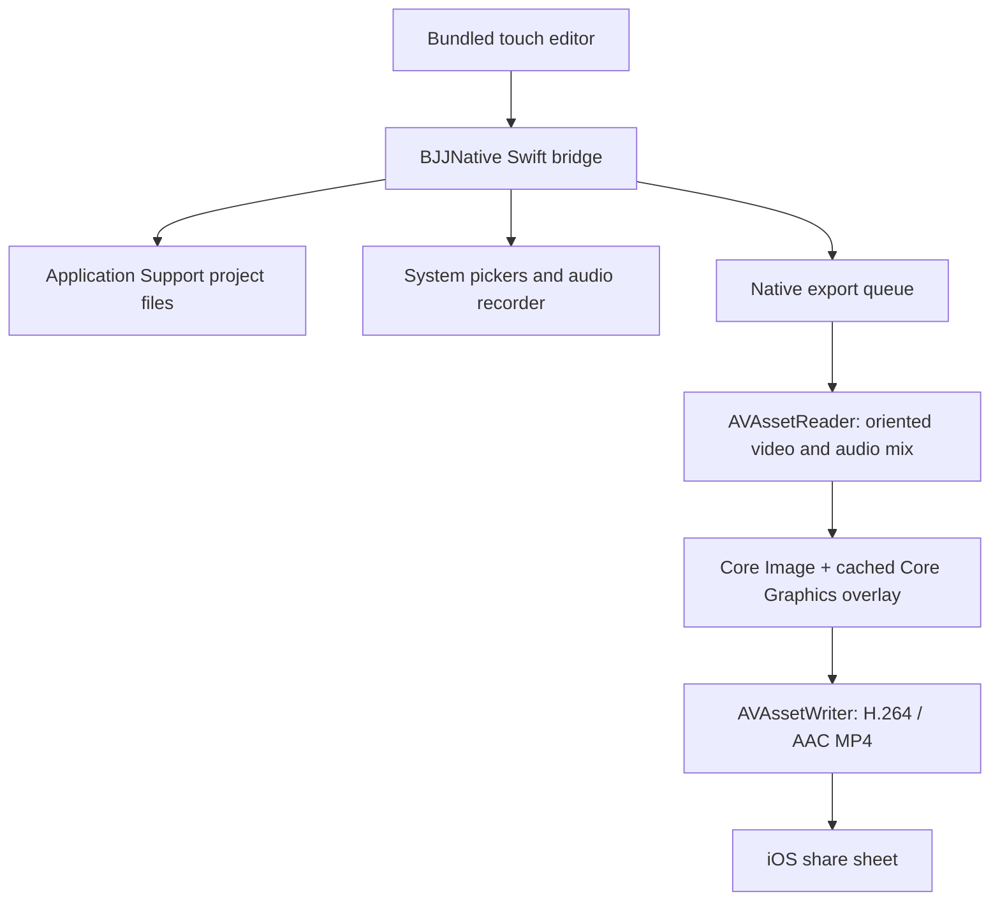

# Architecture

Version 1.1 adds a standalone iOS execution path. The desktop components below remain unchanged; the native implementation is described at the end of this document. The baseline and P1.02/P1.03 candidate Apple SDK tests/archive passed in [GitHub CI](https://github.com/BakedChicken77/bjj-telestrator/actions/runs/34718055711); signed installation and physical-device acceptance remain separate gates.

## Components

The application has one local HTTP origin in production. FastAPI serves the compiled Vite/React frontend and the `/api` endpoints. Pydantic validates persistent data. The filesystem is the project database. Native FFprobe inspects media and FFmpeg generates editing proxies and final MP4 files. The backend runs one process with bounded background export execution; use one Uvicorn worker because job ownership and edit locks are process-local.

The client separates persisted `Project` data, transient editor state (playhead, selection and tool), and local gesture drafts. Zustand stores validated snapshots for undo/redo. Dragging and resizing use a draft, then commit one project change on completion. Media-time changes do not create history entries or saves.

## Import and proxy flow

An uploaded multipart file is spooled and copied in bounded chunks to a generated UUID project/source path with a configured size limit. Filenames are sanitized for display and downloads. FFprobe reads JSON stream metadata: codecs, dimensions, aspect ratios, rotation, frame rate, duration and audio presence. The backend preserves the original bytes, then creates an H.264/AAC MP4 proxy. The legacy import request still completes when its proxy is ready. New clients first reserve a tracked import job, then stream the upload while polling stage/progress and cancellation separately.

Proxies have square pixels and baked display orientation. This makes browser rendering independent of codec-specific rotation support. The browser receives media metadata and project-relative references, never absolute server paths. Byte-range media responses permit seeking without downloading the entire proxy.

## Coordinate mapping

For video display dimensions `Vw × Vh` inside an available stage `W × H`, the contained picture scale is `s = min(W / Vw, H / Vh)`. The picture size is `sVw × sVh` and its centered offset is `((W-sVw)/2, (H-sVh)/2)`. The drawing layer occupies exactly this picture rectangle; black padding outside it is not drawable.

Pointer coordinates relative to the picture map to `u=x/(sVw), v=y/(sVh)`. Geometry is clipped and normalized to `[0,1]`. Export reverses this with the output display dimensions. Strokes, arrowheads and font sizes scale by `min(outputWidth, outputHeight)`; they are not tied to browser CSS pixels. Resizing the window changes only the display transform.

Freehand paths are sampled normalized polylines. Both preview and export use the same vertices and rounded joins/caps. Text uses the same bundled DejaVu Sans font. Annotation order is deterministic by layer, with stable ordering for ties.

## Video and annotation synchronization

Visibility is half-open: `startSec <= mediaTime < endSec`. During playback the stage reads `requestVideoFrameCallback` metadata when supported, with `requestAnimationFrame` fallback. Seeking updates the overlay immediately and again when the media seek resolves. Only components observing the media clock update; persisted project objects remain stable during playback.

Output is constant-frame-rate video at the selected export FPS, initially the source rate when suitable. The renderer rounds a boundary to the first output frame at or after it. Thus output frame `n` represents time `n/fps` and visibility follows the same half-open rule. A boundary between frames can differ from continuous preview by less than one output frame.

## Persistence

Every project owns a UUID directory beneath the data root. All asset paths are relative and checked for containment when resolved. `project.json` is validated and saved using a same-directory temporary file followed by atomic replacement. The client debounces edits and shows save progress/failure. A project browser lists persistent documents so reopening does not depend on browser-local project data.

Undo and redo keep at most 100 in-memory project snapshots; undo history and selection are intentionally session-local. Source/proxy identity and metadata are server-owned and cannot be replaced by a client project edit. An unchanged missing derived preview does not block saving pending edits; source and recording checks remain required. Only the repair service can replace a preview, after validating it and checking the current revision. Completed exports are retained. Project deletion requires an explicit UI confirmation.

## Export renderer

1. Validate and snapshot the saved project, independently of later editor changes.
2. Collect all annotation boundaries and map them to output frame numbers.
3. Divide the timeline into segments with a constant active annotation set.
4. Rasterize each distinct set into a transparent RGBA PNG using antialiased server-side drawing.
5. Build a generated FFconcat overlay stream with exact segment frame durations.
6. Decode and orient the original video, normalize its pixel aspect ratio, composite the timed overlays, and encode H.264 `yuv420p` in MP4 with `+faststart`.
7. Preserve audio timing and encode AAC when audio is present; sources without audio remain valid.

Rasterization happens when a state changes, not once per output frame. Overlay frames stream through FFmpeg, avoiding thousands of independent FFmpeg image inputs. Work is CPU-based. Output dimension rounding accommodates H.264's even-dimension requirement. PNG intermediates cost disk space proportional to distinct states; no entire source video is loaded into Python memory.

All subprocesses use argument arrays and generated local files. User-provided strings are never interpreted by a shell. Standard FFmpeg machine-readable `-progress` output feeds percentage/rendered-time updates. Detailed stderr is logged on failures; the API returns a concise error.

## Export lifecycle

Queued/running jobs are recoverable as interrupted failures after a backend restart; completed jobs and files remain discoverable. Cancellation signals the worker and terminates its active subprocess, then removes incomplete output and temporary state files. A cancelled or failed job never replaces source media or project JSON.

## Voiceover extension

Voiceovers are separate project-relative audio assets with linear timing. Their effective start is `startSec + timingOffsetMs / 1000`. A recording advances with normal video playback and locks arbitrary seeking for its duration. Clips are normalized by the backend before use. Web Audio schedules decoded clips against the media clock, stops them on pause/seek, and restarts at the correct clip offset when playback resumes. The preview checks drift every 40 ms and reschedules when it exceeds 50 ms. Buffering stops scheduled narration until video resumes.

Preview prepares a moving working set (30 seconds ahead and 5 seconds behind), limits download/decode concurrency to two, and budgets inactive decoded audio at approximately 256 MiB. Seeking evicts distant audio and cancels irrelevant preparation. A clip that is currently playing, including overlapping clips, still requires its complete decoded PCM buffer; one 20-minute 48 kHz mono take uses approximately 230 MB of decoded browser memory. Shorter clips reduce this cost. The source video is always streamed.

Final mixing applies original gain/mute, clip gain/mute and master voiceover gain. Each normalized clip is trimmed to its duration, delayed by an exact sample count to its effective start, and mixed on a 48 kHz stereo timeline. Overlapping clips sum at their explicit gains without automatic normalization or ducking. A latency-compensated 0.98-peak limiter with no makeup gain prevents clipping peaks without changing ordinary-level audio. The final audio is padded/trimmed to video duration and encoded as AAC. A muted original audio stream remains a silent AAC track; a source without audio and without audible voiceovers exports without an audio stream. Waveform editing and pause/resume within a single recording are outside the first voiceover implementation.

Audio registry sidecars (`voiceover/<clip-id>.json`) bind generated WAV assets to immutable sample metadata. They make new recordings available for preview before the next project autosave. Removing a clip from the editor updates the project document while retaining its asset for undo and running export snapshots; unreferenced recordings remain retained through project trash and checkpoints. The individual recording-delete API returns ASSET_RETAINED; only explicitly confirmed permanent project deletion reclaims them.

## Boundaries and tradeoffs

- No database service is needed for a local single-user tool. One backend process is required.
- Every import generates a proxy, trading initial processing time and disk space for predictable Edge/Chrome playback.
- Static overlays avoid tracking complexity and provide reproducible exports from project data.
- Normalized square-pixel display geometry handles portrait, rotation and anamorphic sources consistently.
- Native FFmpeg supports long CPU renders without freezing the browser. GPU acceleration is optional future work.
- The microphone API requires a secure context; browsers treat `localhost` as trustworthy.
- No media leaves the local machine. Public deployment would require an explicit new security/storage architecture.

## Standalone iPhone components

The shared React/Konva editor is bundled into a Capacitor 8.5.1 WKWebView. `native.ts` switches typed project/export APIs and asset lookup to a custom `BJJNative` bridge when the platform is native iOS. Desktop browsers retain their existing HTTP calls. No development server URL is configured in the iOS application. Native filesystem paths do not cross the JSON bridge.

`BJJViewController` installs the plugin and a custom scheme handler in both the scene and storyboard startup paths. `BJJAssetHandler` serves same-origin UUID routes under `capacitor://localhost/bjj-media/`, supports single HTTP byte ranges, and reads at most 256 KiB per chunk. Bundled app assets are delegated to Capacitor's original handler. Generic raw filesystem URLs are blocked. URL scheme operations handle WebKit request cancellation before delivering further data.

## iPhone import, storage, and recovery

Photos uses PHPicker; Files uses security-scoped document URLs. Original bytes are copied into a generated project/source path. Photos temporary provider URLs are copied before their callback ends. AVFoundation validates actual video/audio tracks, coded/presentation dimensions, pixel aspect ratio, preferred transform, and video time range. A square-pixel SDR H.264/AAC proxy is generated at a maximum 1920-pixel long edge. The original remains the final-render input. Unsupported HDR and non-right-angle rotation produce errors instead of silently exporting incorrect color/orientation.

`BJJProject` mirrors project validation and preserves the raw JSON dictionary for additive future fields. `BJJStore` validates UUID/path containment, preserves imported media metadata, and atomically replaces JSON files. `voiceover/assets.json` registers immutable audio metadata. `voiceover/pending.json` journals recordings until the editor has saved a document containing the take, so native interruption recovery survives an earlier autosave that lacks it. Existing recordings are retained for undo and export snapshots. Projects live in Application Support and survive app restarts; uninstalling removes them. There is no desktop-to-phone project transport or cloud synchronization.

The web editor debounces saves and attempts a flush when hidden. Normal app closing should follow the Saved indicator; iOS can suspend WebKit before an asynchronous last-second save completes. Native microphone completion additionally persists the clip without relying on JavaScript execution. This is why a dedicated native recorder is used rather than MediaRecorder on iPhone.

## iPhone recording and preview

`AVAudioRecorder` writes 48 kHz mono 16-bit WAV directly to the project. Capture advances linearly with the video, auto-stops at the remaining media duration, and stops on playback pauses/buffering or native audio/background interruptions. An interruption event brings the persisted clip back into the editor. Bridge round-trip compensation estimates the actual start; a manual nudge remains available. Bluetooth/input latency and the requested approximately 100 ms alignment need physical-device measurement.

The existing Web Audio scheduler is reused with native same-origin audio routes. This preserves one media-linked audio clock, seek-into-clip offsets, overlapping voices, resynchronization, gain and mute behavior. Full decode of active narration takes remains a mobile memory tradeoff; short takes are recommended. The iOS audio session switches between playback and play-and-record while using the speaker/headphones appropriately.

## iPhone final renderer and lifecycle

Each job snapshots a validated project. One native job runs at a time. `AVMutableComposition` places source video at project time zero, intersects the original audio track with that video time range, and preserves its relative start offset. Voiceover tracks are trimmed and inserted at their effective timeline starts. An `AVAudioMix` applies normalized per-track gains; decoded Float32 samples restore the shared gain and clamp peaks to 0.98 before AAC encoding. This simple native overload protection differs from the desktop look-ahead limiter.

`AVAssetReaderVideoCompositionOutput` supplies display-oriented, square-pixel frames at the chosen constant frame rate. An annotation boundary is rounded up to the first output frame at or after it. Core Graphics recreates all six annotation types using normalized geometry and the bundled DejaVu Sans font; a cached transparent CIImage is rebuilt only when the active set changes. Core Image composites it over each source frame. AVAssetWriter streams H.264 video and 48 kHz stereo AAC into an optimized MP4. Only encoder buffers and one overlay state are retained; source videos never pass through Base64 or JavaScript memory.

Native output uses even source display dimensions and at most 60 fps. Shared CRF quality values map to a bounded bitrate; Apple's encoder does not offer libx264's CRF/preset semantics. Native image/text antialiasing can differ slightly from the desktop rasterizer. Final validation checks H.264, AAC/audio presence, dimensions, and duration before moving a completed output out of `temp/`.

Jobs persist status/filename/error metadata. Cancellation cancels the reader/writer and cleans partial output. A status monitor handles an encoder that fails without requesting more input. Previously queued/running jobs become interrupted failures on relaunch. The app requests a finite iOS background task and disables automatic screen sleep while rendering; it does not claim unrestricted background processing. Background expiry cancels safely. Successful outputs remain available through the system share sheet.

## iPhone build and verification boundary

`frontend/ios/App/App.xcodeproj` is the real SPM-based app project, with a shared App scheme and hosted AppTests target. `scripts/configure_ios.py` reproducibly adds app-owned Swift files without replacing the generated project. `scripts/test_ios.py` invokes Xcode simulator tests and records an `.xcresult`. Linux checks validate the TypeScript bridge and touch editor; Swift syntax/project inspection cannot establish Apple SDK type compatibility or runtime correctness. The baseline macOS build, 11 native tests, and unsigned archive passed in CI. The P1.02/P1.03 candidate then passed all 15 native tests and an unsigned archive in [run 34718055711](https://github.com/BakedChicken77/bjj-telestrator/actions/runs/34718055711). Signing and physical iPhone acceptance remain required before release.

## Authoritative project saves (schema 2)

The shared `SaveSession` owns the only editor write queue, used by autosave,
explicit save, native recording, lifecycle flushes, and export. It consumes the
service acknowledgment and advances storage revision separately from edit history.
Edits arriving during a save are saved next against the acknowledged revision.
A lost response is reconciled only if the newer durable document has identical
editable content. Conflicts stop retries and retain a local journal for recovery.

Desktop `ProjectStore` serializes conditional read/check/write with its existing
recursive lock in the single-process local server. Do not launch multiple writers
against the same data root. Native `BJJStore` uses its recursive lock; bridge calls
remain serialized. Recorded takes first enter the durable recording journal;
reopening or saving incorporates them into a new committed revision. Export reads
committed content, so pending recordings cannot silently change an old revision.

Recovery copies validate source/recording ownership and produce independent local
files and fresh object IDs. Copy failure removes only the uncommitted destination.
Native copy work now runs off the main actor; the store lock serializes installation
and copying. Large-copy responsiveness and interruption remain physical-device gates. Edit drafts
contain project JSON, never source bytes. Support summaries are allowlisted,
user-initiated and inspectable; no telemetry or automatic transfer was added.

## Durable export/recovery foundations (P1.06)

`assets.py` / `BJJAssets.swift` maintain lazy, incrementally hashed asset manifests
and operation space estimates. `render_plan.py` / `BJJRenderPlan.swift` validate
immutable versioned job inputs. `JobManager` / `BJJService` persist those inputs
before queueing, revalidate assets before and after rendering, probe staged MP4s,
and finalize atomically. Restart marks interrupted work failed and offers a new
attempt from the original revision. Retrying always starts at zero.

The shared `ExportRecovery` controls display revision/staleness, retry and completed
MP4 cleanup. `ProjectStorage` displays a per-project breakdown and estimates.
Capability reporting hides these controls when an older local service lacks them.
New routes: `GET /api/projects/{id}/storage`, `POST /api/exports/{id}/retry`, and
`DELETE /api/exports/{id}/file`; corresponding native bridge calls remain local.

Project leases cover queued/running jobs and downloads/share sheets; cleanup
cannot remove a leased output. All source/recording assets are retained, including
removed takes. Permanent individual-take deletion now fails explicitly because
undo/recovery/export inputs may still own it. No new project schema, cloud service,
media library or state framework is introduced. Disk estimates do not reserve OS
space or guarantee completion; write failures clean temporary work and retain
committed inputs. Detailed contracts/limitations: [decision 002](docs/decisions/002-durable-export-inputs.md).

## Checkpoints, duplication and retained deletion (P1.06)

`recovery.py` / `BJJProjectVersions.swift` consume the existing immutable render-plan
and asset contracts. A checkpoint holds a saved project revision and its required
source/recording checksums. Restore verifies them, writes a durable before-restore
checkpoint, then uses the normal conditional save to advance the current revision.
If any write/verification/conflict fails, existing durable edits remain available.
Source, current proxy metadata and creation identity are never rolled backward.
Opening the restored review resets in-memory history; its prior state is a durable
checkpoint rather than a history entry carrying an old storage revision.

Duplicates reuse recovery-copy validation, remap editable UUID references and
copy/hash required media. Copy failure removes only the new destination. Native
hash/copy operations run off the main actor; the existing store lock protects
copy/install/delete from concurrent writers. These operations show an indeterminate
working state and have no separate cancellation or resumable copy job yet.

Deletion writes versioned metadata before one same-volume directory rename into
`projects/recently-deleted/<trash UUID>/projects/<project UUID>`. No asset is removed
at this stage. Restore validates current assets/recording ownership and atomically
moves the whole directory back. A collision creates an independent current-review
copy; the complete archived folder stays available. Permanent removal is a distinct
UUID-scoped action. Export recovery is scoped to the restored project and never
reclassifies unrelated running jobs. No automatic trash expiry or recording GC is
introduced. Native pending save transactions and pre-migration files stay inside
the moved directory. These are local recovery mechanisms, not portable backups.

## Observable media preparation (P1.04 work package)

`MediaJobs` / `BJJMediaJobs` reuse the existing FFmpeg / AVFoundation pipeline.
Version-1 operation records live in `media-jobs/`, separate from project history.
The shared hook remembers only an operation UUID, resumes status polling after
reload and uses the existing adapter for real cancel/repair calls. Stage changes
are durable; bounded copy/encoder progress is runtime state. Upload transfer and
Photos retrieval remain indeterminate until bytes are measurable. Each manager
allows at most two outstanding operations and retains at most 256 records.
Desktop encodes serially; native work is asynchronous. No new dependencies.

Files copy in 1 MiB chunks with cancellation and space checks. Photos copies its
provider URL directly into project-owned staging before the callback expires,
avoiding a second full-size temporary copy or JavaScript media strings. Desktop
FFprobe/FFmpeg are cancellable subprocesses with bounded progress buffering.
Both services inspect source timing/orientation, prepare a maximum-1920 / up-to-30
fps preview, probe codec/dimensions/duration/audio and recheck source SHA-256.
Repair leases the project, checks source metadata and the authoritative revision,
then installs a generated preview reference and atomic project revision. Previous
previews, originals, recordings, checkpoints and immutable export inputs remain
retained. Path/setup failures also release the lease. Clients cannot supply
arbitrary paths or invoke the internal media-replacement save flag.

Restart marks unfinished work interrupted and removes uncommitted import staging.
An import whose project was atomically installed is recovered as complete. An
interrupted repair may already have a valid committed replacement; its status can
be failed if the terminal operation record was not written. Reopening always uses
the authoritative document. Retrying safely restarts preparation; there is no
checkpoint resume or guarantee of iOS execution after backgrounding/force-quit.

The viewport URL includes the current proxy reference as a cache discriminator;
autosave alone does not reload video. Completing repair reopens the saved project,
with the existing new-session undo behavior. Source logical duration is retained
independently of proxy frame rounding. Inspection retains reported color/rational
metadata, but does not infer exact PTS or CFR from average frame rate. Desktop
explicitly rejects known PQ/HLG/Dolby Vision at import and export; native HDR
rejection remains. HDR-to-SDR conversion and phone footage acceptance are pending.
