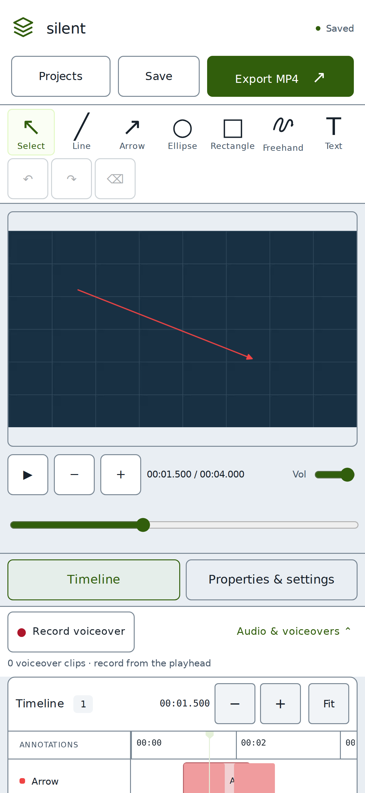

# BJJ Telestrator for iPhone

This repository now includes a standalone iOS application alongside the working Windows/Docker application. The iPhone app bundles the React annotation editor in Capacitor 8.5.1 and uses Swift, AVFoundation, Core Image, and Core Graphics for local files, microphone capture, and H.264/AAC MP4 rendering. It does not connect to the Windows computer or require Docker at runtime.

**Release status:** the P1.06 recovery candidate at `33be6315eb4fdee79ac7fe5d973292bfc09b182f` passed all 22 native XCTest cases, the unsigned archive and every other gate in [CI](https://github.com/BakedChicken77/bjj-telestrator/actions/runs/34727786132). Signing, installed updates, physical-iPhone export/share, and a realistic 20-minute workload remain unverified. An unsigned archive is not an installable IPA. GitHub-hosted macOS runners support the Windows-only development route.

## Windows-only build and distribution route

Use [docs/GITHUB_SETUP.md](docs/GITHUB_SETUP.md) to create the repository and start automated native tests/builds on GitHub. Signing and optional TestFlight delivery use your Apple developer credentials. The simulator and unsigned archive produced without those credentials cannot be installed directly on an iPhone.

## Alternative: install using a Mac

You need a Mac capable of running Xcode 26 or newer, its iOS SDK/simulator components, Node.js 24, and an iPhone running **iOS 17 or newer**. Xcode must support the iOS version currently installed on your phone. The app's minimum iOS version is a deliberate project setting, not Capacitor's minimum. Capacitor's documented iOS build prerequisites require macOS and Xcode; Windows Docker cannot produce an Apple-signed app. See the [official environment requirements](https://capacitorjs.com/docs/getting-started/environment-setup).

1. Copy/extract the entire `bjj-telestrator` folder onto the Mac. Start Xcode once and install its requested platform components.
2. In Terminal, from that folder, build the bundled editor:

   ```bash
   cd frontend
   npm ci
   npm run ios:sync
   npm run ios:open
   ```

3. In Xcode, select the **App** project, then the **App** target → **Signing & Capabilities**. Enable automatic signing and choose your Apple Account's team. Replace `com.bjjtelestrator.app` with a unique identifier if Xcode says it is unavailable. Use the same identifier in `frontend/capacitor.config.ts`. For device tests, also set the AppTests target's team and a matching unique test bundle identifier.
4. Connect the unlocked iPhone to the Mac, accept its Trust prompt, and select the phone as Xcode's run destination. If requested, enable **Settings → Privacy & Security → Developer Mode**, restart, and confirm. Follow Xcode's device pairing/provisioning prompts. Apple's [device preparation guide](https://developer.apple.com/documentation/xcode/running-your-app-in-simulator-or-on-a-device) describes this flow.
5. Run **Product → Test** first on an iPhone simulator and resolve any build/test failures before using real coaching projects. Then select the physical iPhone and press **Run**. Keep the original installation when updating so its project container is retained.
6. Open **BJJ Telestrator** on the phone. It runs from its own app icon. Disconnecting the Windows computer has no effect on editing/export.

A free Apple Account can use Xcode's Personal Team for personal device testing. Apple currently limits that provisioning to seven days, after which the app must be rebuilt/reinstalled. Paid Apple Developer Program membership is needed for TestFlight/App Store distribution. See Apple's [developer account overview](https://developer.apple.com/help/account/basics/about-your-developer-account). Do not delete the app merely to renew signing: deleting it deletes its local projects.

If you only have Windows, follow [GitHub setup](docs/GITHUB_SETUP.md). The included workflows use GitHub-hosted macOS/Xcode machines, with optional signed IPA and TestFlight upload after Apple credentials are configured. You do not need to own a Mac for that route. Apple enrollment, credential provisioning, a fresh candidate build, and on-phone acceptance remain required. The passing baseline does not attest to a different candidate.

## On-phone workflow

1. In Projects, select **Photos** or **Files**. Choose an SDR MP4/MOV recording. The system Photos picker grants access only to the selected item; the app does not scan the photo library. If an original exists only in iCloud, the system may need to download it first.
2. Follow Copying, Inspecting, Preparing preview and Validating. **Cancel preparation** stops copying or encoding and removes incomplete staging. Leave the app open while preparing long footage. The selected original is preserved byte-for-byte; Photos may first need to retrieve its file.
3. Scrub to a moment, choose a tool, then drag one finger on the video picture. The toolbar scrolls sideways to expose all tools, undo, redo, and delete. A second touch does not take over a drawing gesture.
4. Use **Timeline** for selection, time shifting, edge trimming, and zoom. Use **Properties & settings** for precise time values, text, colors, width, opacity, layer order, and project defaults. Portrait and landscape layouts share the same normalized geometry.
5. Wait for **Saved** before closing the app. Projects reopen from the Projects button. Undo/redo history is local to the current editing session.
6. Press **Record voiceover**, allow microphone permission, and speak as the video advances. Press Stop to save. A pause, seek attempt, buffering, backgrounding, or audio interruption ends the take to preserve its linear timeline. Reposition and record again for another take. Headphones reduce speaker feedback into the recording.
7. Open **Audio & voiceovers** to adjust original audio, clip/master gain, mute, clip position, or timing nudge. Delete/rerecord as needed. Deleted clips remain available for undo until the project is deleted.
8. **Export MP4 → Render MP4** renders on the phone. Keep BJJ Telestrator in the foreground and allow storage/CPU time. Progress, cancellation, and errors are shown. After completion, **Save or share MP4** opens the iOS share sheet; choose Save to Files, Save Video if offered, AirDrop, or another installed recipient app. Sharing occurs only when you choose it. Play the resulting MP4 outside BJJ Telestrator to confirm the burned-in annotations and audio.

For a missing or damaged editing video, use **Projects → Repair preview**. This
saves pending edits, prepares and validates a replacement from the same original,
then reopens the review at a new revision. Drawings and narration are preserved;
undo starts a new session. Old previews remain retained. If the app was closed
mid-preparation, check its recorded outcome after reopening and start again when
requested. Preparation retries start from the beginning.

The Photos selection determines the imported asset. An original high-speed file
can have different timing from a Photos-rendered slow-motion edit. The app keeps
the selected asset's timeline and does not recreate Photos speed ramps. A preview
at up to 30 fps cannot expose every original high-speed frame; exact source-frame
navigation, VFR/high-speed hardware acceptance and HDR conversion remain open.

The exported recipient needs only the MP4. No project file or special player is required.



## Build and test commands

Shared editor checks, from `frontend/`:

```bash
npm test
npm run lint
npm run typecheck
npm run build
npm run format:check
npm run ios:sync
```

The desktop and touch-browser suites use the Python backend and FFmpeg as their media test fixture service. Install the backend dependencies and Chromium as described in README.md, then run from the repository root:

```bash
backend/.venv/bin/python scripts/verify.py --browser
```

For only the phone-layout browser scenarios:

```bash
cd frontend
BJJ_E2E_PYTHON="$(pwd)/../backend/.venv/bin/python" npm run test:mobile
```

These tests drive real Chromium touch events and export through FFmpeg; they do not substitute for WKWebView/AVFoundation testing.

On a Mac, after `npm run ios:sync`, run actual native simulator tests from the repository root:

```bash
python3 scripts/test_ios.py
# Or choose a specific installed simulator:
python3 scripts/test_ios.py --device <simulator-UDID>
```

The runner invokes `xcodebuild test`, saves an `.xcresult` under `tests/generated/`, and fails clearly outside macOS. Alternatively use Product → Test in Xcode with the shared **App** scheme. The tests in `BJJNativeTests.swift` include native generated video/tone fixtures and actual MP4 rendering, half-open boundaries, dimensions/orientation, audio mixing/nudge, source preservation, atomic persistence/recovery, path safety, and job cancellation. **All 22 native tests passed for the recovery candidate on GitHub macOS runners ([evidence](https://github.com/BakedChicken77/bjj-telestrator/actions/runs/34727786132)); test every later application candidate again.**

When adding Swift source files, run `python3 scripts/configure_ios.py` to wire them into the Xcode app target. The app uses Swift Package Manager; CocoaPods is not required. Do not run `cap add ios` over the customized checked-in project.

## Required physical-device acceptance

Before treating this as a verified iPhone release:

- Import a 20-second SDR landscape video with original audio. At 5 seconds create a red arrow `[5,10)`; at 7 seconds create a yellow ellipse `[7,9)`. Check 4.9/5/7.5/9.5/10 seconds, then move/resize, trim, undo/redo, save, and reopen after force quitting.
- Export and share to Files. Play the MP4 in Photos or another standard player; confirm timing, orientation, original audio, duration, and intact source footage.
- Repeat with portrait, rotation metadata, SDR HEVC MOV, silent video, and variable-frame-rate camera footage. Check annotations after rotating the phone.
- Record two microphone takes. Seek into the middle of each for preview, mute/lower original audio, change gain/nudge, delete/undo a take, and verify the final audio mix. Check headphones/Bluetooth and microphone-denial recovery in Settings.
- Background the app during a recording and reopen it. Verify the recovered clip. Interrupt/cancel a render; confirm a useful error or cancellation and an intact project.
- Test a representative 20-minute 1080p rolling video with at least 100 annotations. Observe memory, storage, heat, and export time on the target iPhone. No long-video iPhone performance result has been measured here.

## Local data and limits

- Native projects are stored in the app's Application Support container under `BJJTelestrator/projects/<uuid>/`. The directory contains project JSON, original/proxy media, recordings, export metadata/MP4s, and temporary files. It survives normal restarts and same-identity app updates. Removing the app removes its container. There is no portable editable-project backup/restore interface yet; share completed MP4s to Files and retain original camera recordings. Windows projects and iPhone projects are separate; there is no automatic sync or project migration UI.
- Native import is capped at **4 GiB**, **4096 pixels on the long edge**, and 24 hours by validation; those are input bounds, not a performance promise. Typical 1080p coaching clips are the target. Proxy long edge is at most 1920 and preview rate is at most 30 fps; final dimensions default to source display dimensions, rounded to even pixels. Exports support up to 60 fps.
- Native HDR PQ/HLG footage is rejected with instructions to provide an SDR copy. Common iPhones record HDR by default; turn off **HDR Video** in Camera recording settings for new test clips or first export a genuine SDR copy using an editor. SDR HEVC is supported by the implementation. Non-right-angle rotation is rejected. Dolby Vision/HDR color correctness is not claimed.
- Native encoding uses Apple's H.264 encoder, not FFmpeg/libx264. The shared quality field maps to a bounded bitrate; encoding-speed presets are hidden on iPhone. Audio is mixed at 48 kHz stereo and encoded as AAC. Native mixing clamps peaks to 0.98 after gain, which can distort heavily overloaded mixes; reduce gains. Desktop export retains its look-ahead limiter. Output is ordinary H.264/AAC MP4, but native encoder profiles/chroma/audio priming must be checked on the target device.
- Rendering is foreground work. iOS can suspend apps and stop extended background encoding. The app keeps the display awake during import/export; background expiry cancels safely, and interrupted jobs are marked failed after relaunch. There is no background-render guarantee.
- Media files are streamed in bounded chunks; native rendering holds one overlay state and encoder buffers. Web Audio still decodes each active narration take completely. Prefer short takes on memory-constrained phones. Text uses bundled DejaVu Sans; Core Text and Canvas antialiasing/metrics can differ slightly.
- No app analytics, tracking, cloud backend, account system, watermark, or remote media-upload service is added. The system Photos/Files picker may access locations you explicitly choose. An iOS privacy manifest and microphone/Photos-save purpose strings are included; review the final archive's privacy report before distribution.

## Troubleshooting

- **Xcode command-line tools missing:** open Xcode Settings → Locations and select Xcode's command-line tools; install the iOS components. `xcodebuild -version` should report Xcode 26 or newer.
- **Swift packages will not resolve:** the first build needs Internet access to fetch Capacitor's pinned Swift package. In Xcode, use File → Packages → Resolve Package Versions. The completed app does not need that connection.
- **Signing/bundle identifier error:** select your own team and a unique identifier. Keep it stable across updates. Free Personal Team signing expires; re-run from Xcode when needed.
- **Blank editor or missing DejaVu font:** run `npm ci` and `npm run ios:sync` from `frontend`, then rebuild App. The required bundled `public/` folder is generated by that command.
- **Microphone denied:** enable BJJ Telestrator under Settings → Privacy & Security → Microphone. Close other recording apps and retry. A failed take must restore editor controls.
- **Video not available:** download the original from iCloud first, check free storage, and use a complete SDR H.264/HEVC MP4 or MOV. iOS supports fewer source codecs than the desktop FFmpeg build.
- **Export stops when switching apps:** reopen BJJ Telestrator, start a new export, and leave it in the foreground. Completed exports remain in the project.
- **Need diagnosis after a native error:** reproduce with a short non-sensitive test clip while connected to Xcode; inspect the `com.bjjtelestrator.app` media log. Do not overwrite or delete the original recording.

Apple/Capacitor build and provisioning references were checked on 2026-09-10. Device acceptance is still required.

## Save recovery and candidate evidence

Schema-1 JSON is retained as `project.pre-migration-v1.json` before migration.
Pending edit drafts are stored in the native application container, separately
from project JSON, throughout editing. Before suspension the bridge requests a
flush while execution is available; a final lifecycle callback is not guaranteed.
Recording recovery has its own asset journal and commits a revision when reopened.
Use **Recover draft as a copy** to preserve both the saved review and pending edits.
A completed copy has independent media files and object IDs. Keep the app open
while large media is copied. Copying and checksums run off the main actor; there is
no separate copy-cancel control yet. The editor shows an indeterminate working state.

Use [DEVICE_ACCEPTANCE.md](docs/DEVICE_ACCEPTANCE.md) for the exact signed-build
checklist and result fields. Retain the same bundle identity when installing an
update over projects. Never uninstall as a routine rollback step.

### Storage and export recovery (P1.06 work package)

The export panel now shows local storage breakdown and estimated additional export
space. After a restart, **Retry revision … from start** renders the original saved
review; **Render MP4** renders current confirmed edits. Keep the app open as before.
First-export inventory preparation hashes large originals off the main thread;
queued/running jobs remain cancellable, while initial inventory preparation has
no separate cancel control yet. Integrity checks are incremental and never pass
large media through JavaScript.

**Remove MP4** reclaims a completed output and retains its retry input and all source
and recording assets. An active share sheet protects that file until dismissed.
Old jobs without saved inputs cannot retry their old edits. Whole-project deletion
now retains the project in **Recently deleted**. Files `.bjjproj` transfer remains
later work. Simulator/CI verification does not establish physical
low-space, share-sheet, thermal or 20-minute performance acceptance.


### Local project versions

In **Projects**, expand **Checkpoints and copies** for the current review. Save a
named checkpoint, restore a previous one, or duplicate the saved project. Restore
first preserves the current revision as a checkpoint; source and recording files
stay immutable. A duplicate has fresh IDs and copied media, with no shared hard links.

Deleted projects remain in **Recently deleted** with all their recordings,
checkpoints and exports until separate permanent deletion. Restore retains the
original ID when available; a collision creates a new review and leaves the full
deleted project intact. These local copies do not protect against uninstall or
phone loss. Keep the same bundle identity for updates and never uninstall as a
routine rollback. Physical suspension, large copies, VoiceOver and low-space
behavior still require the candidate-specific device checklist.
