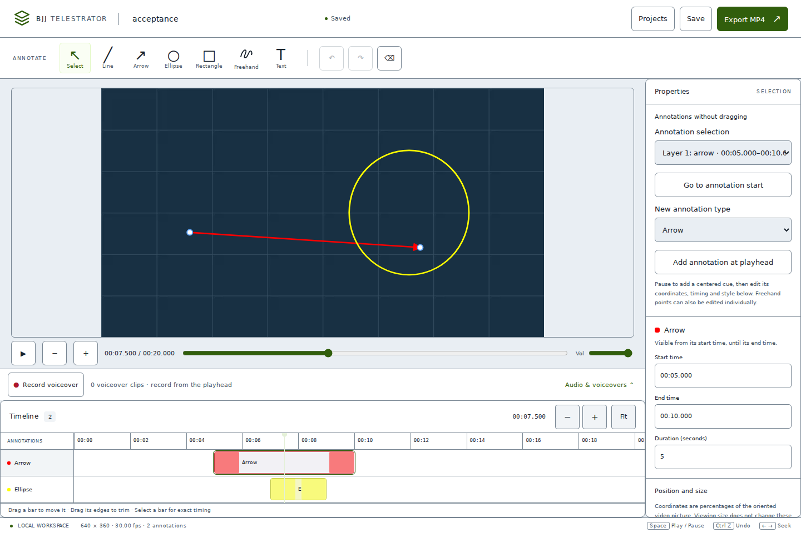
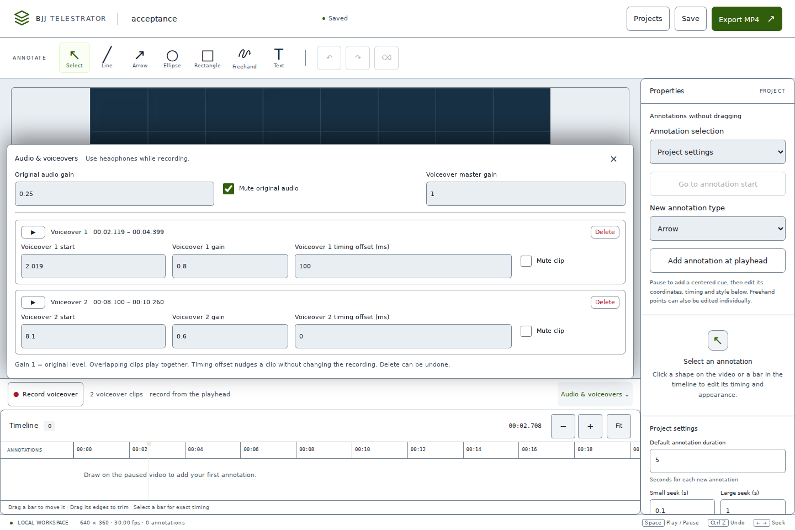

# BJJ Telestrator

A local desktop browser editor for reviewing Brazilian Jiu-Jitsu footage. Import a video, draw timed arrows, lines, ellipses, boxes, freehand paths and text, record coaching voiceovers, and export one ordinary MP4 with annotations permanently burned into the picture and commentary mixed into its audio. Originals are preserved. Projects and completed exports stay on your computer.

**iPhone conversion:** version 1.1 adds a touch-adapted editor and a standalone Capacitor/Swift iOS target with native storage, import, recording, and MP4 export. Start with [IOS_README.md](IOS_README.md) for installation and native test instructions. It requires iOS 17+; GitHub-hosted macOS runners can build and sign it, so you do not need to own a Mac. All 22 native XCTest cases and the unsigned archive passed for this implementation ([CI evidence](https://github.com/BakedChicken77/bjj-telestrator/actions/runs/34727786132)); signed installation and physical-device acceptance remain pending; the ZIP is source, not an installable signed IPA. The existing Windows/Docker path remains supported.

**GitHub automation:** [docs/GITHUB_SETUP.md](docs/GITHUB_SETUP.md) includes the Windows repository-creation command, CI/release gates, and optional Apple signing/TestFlight setup. The owner created the public GitHub repository. Workflow configuration is included; repository-admin settings still require the owner’s GitHub CLI or Settings access.

**Windows verification update:** on 2026-09-10 the user reported that the application worked on Windows 11 using Docker Desktop. This supersedes the original delivery's outstanding Windows launch check; no additional hardware-specific results are inferred from that report.



A generated [sample annotated MP4](docs/sample-annotated.mp4) is included to demonstrate the exported file format.

## Windows 11 quick start

Install Docker Desktop with the WSL 2 backend, start Docker Desktop, extract this repository, and open PowerShell in the extracted `bjj-telestrator` directory. Run:

```powershell
docker compose up --build
```

Open **http://localhost:8000** in Microsoft Edge or Google Chrome. The first build downloads dependencies and FFmpeg. Afterward, the application requires no cloud service, paid API, account, or Internet connection.

Stop with Ctrl+C or `docker compose down`. Projects remain in the named `bjj-telestrator_bjj-projects` Docker volume (the Compose project prefix depends on your folder name). **`docker compose down -v` deletes that volume and its projects.** Back up the volume before resetting Docker Desktop or removing Docker storage.

The container listens on its own network interface; Compose publishes it only to `127.0.0.1`. Keep this local binding: authentication and public hosting are outside this application's scope.

## Editing workflow

1. Import a video and wait for its browser editing proxy to finish.
2. Seek to a coaching moment, select a tool, and draw on the picture. Drawing pauses playback.
3. Select an object in the picture or its timeline row. Move or resize it, edit style in the inspector, and drag its timing bar or trim either edge.
4. Preview by playing or scrubbing. Each annotation appears at its start and disappears exactly at its end.
5. Wait for **Saved** before closing the browser. Reopen projects through the project browser.
6. Export. The job runs on the backend; its progress, cancellation and download remain available independently of browser playback.

The desktop interface consists of a project/save/export top bar, annotation toolbar, central video stage and playback controls, properties inspector, and zoomable annotation timeline. It is designed for a 1280×720 or larger display.

Shortcuts outside text controls: Space play/pause; Delete or Backspace delete selection; Ctrl+Z undo; Ctrl+Y or Ctrl+Shift+Z redo; Escape cancel drawing/clear selection; Left/Right seek by the project small step; Shift+Left/Right use the large step.

## Recording commentary

1. Seek to the moment you want to explain and press **Record voiceover**. Allow microphone access when the browser asks.
2. Speak while the video plays forward, then press **Stop recording**. Seeking, drawing and switching projects stay locked until the recording has finished saving.
3. Open **Audio & voiceovers** to preview clips, adjust their start or timing offset, set individual/master gain, mute clips, or lower/mute the original audio.
4. Stop, seek, and record again to add another clip. Overlapping clips play and export together. Remove a take with Delete and record its replacement; deletion can be undone.

Use headphones to keep speaker playback out of the microphone. Existing narration is muted during recording. Pause, buffering or video end stops a take so its timeline mapping stays linear; pause/resume inside one take and arbitrary seeking during recording are intentionally disabled. Gain 1 is unity. The monitor-volume slider affects local listening only; the original/voiceover gains in Audio & voiceovers affect both preview and export.

Microphone uploads are normalized to 48 kHz mono PCM WAV; final mixing produces 48 kHz stereo AAC. Preview is driven by one Web Audio clock and resynchronizes after seeking or interruptions. Removed recordings remain as unreferenced project assets to support undo and running export snapshots; deleting the project removes those assets too.



## Native development on Windows

Prerequisites: Python 3.12, Node.js 24, and FFmpeg/FFprobe on `PATH`. Check both `ffmpeg -version` and `ffprobe -version`. Use two PowerShell windows.

Backend, from the repository root:

```powershell
cd backend
py -3.12 -m venv .venv
.\.venv\Scripts\python.exe -m pip install -r requirements.txt
.\.venv\Scripts\python.exe -m uvicorn app.main:app --host 127.0.0.1 --port 8000 --reload
```

Frontend, from the repository root:

```powershell
cd frontend
npm.cmd ci
npm.cmd run dev -- --host 127.0.0.1
```

Open http://localhost:5173 during development. Vite proxies `/api` requests to the backend. For a native production build, run `npm.cmd run build` in `frontend` and use the backend URL http://localhost:8000; FastAPI serves the compiled assets.

## Verification

Testing commands and measured results are recorded in `docs/VERIFICATION.md`. Run these from the repository root (use `.venv/bin/python` in place of `.venv\Scripts\python.exe` and `npm`/`npx` in place of `npm.cmd`/`npx.cmd` on Linux/macOS):

```powershell
cd backend
.\.venv\Scripts\python.exe -m pytest
.\.venv\Scripts\python.exe -m ruff check .
cd ../frontend
npm.cmd test
npm.cmd run lint
npm.cmd run typecheck
npm.cmd run build
```

For all checks including the real browser export workflow, install Chromium once and run the verification script from the repository root:

```powershell
cd frontend
npx.cmd playwright install chromium
cd ..
.\backend\.venv\Scripts\python.exe scripts/verify.py --browser
```

The script generates its fixtures and starts isolated backend/frontend test servers on ports 8010 and 5174. Omit `--browser` for unit, FFmpeg integration, lint, type and production-build checks. The browser suite and FFmpeg integration tests use generated media; uploaded user footage is never included in the repository. The standalone fixture generator is also available:

```powershell
py scripts/generate_test_video.py
```

## Data, imports and exports

The backend stores project directories under its configured data root; Docker maps this to `/data` in the persistent named volume. Each project contains `project.json`, the untouched `source/` upload, a generated `proxy/` MP4, `voiceover/` assets, completed `exports/`, and a `temp/` work area. Project JSON references only relative assets. See `PROJECT_FORMAT.md`.

Inputs are inspected with FFprobe. Common FFmpeg-decodable MP4, MOV, HEVC/iPhone, WebM, MKV and AVI sources can be imported; actual codec availability in the bundled FFmpeg is authoritative. Every import generates a square-pixel H.264/AAC MP4 proxy with rotation baked in. Final rendering uses the original source and normalized annotations, not the browser canvas or proxy pixels.

Exports use H.264, `yuv420p`, AAC when audio exists, and MP4 fast-start metadata. Annotation intervals are quantized to output-frame boundaries, with less than one output frame of temporal rounding. Source display orientation and aspect ratio are preserved; square-pixel H.264 requires even dimensions, so odd or non-square-pixel source dimensions can be rounded by a pixel. The same bundled DejaVu Sans font is used in preview and rendering; see `assets/FONT-LICENSE.txt`.

## Configuration and troubleshooting

Copy `.env.example` to `.env` for Compose overrides. Native execution does not load `.env`; set overrides in PowerShell, for example `$env:BJJ_DATA_DIR = "D:\BJJProjects"`. Native projects default to `<repository>\data\projects`. Video uploads default to a 4 GiB limit; individual microphone uploads have an additional 512 MiB cap. Allow enough free space for the untouched upload, proxy, export and temporary overlays; a full disk causes import/export failures with the project retained.

- **Port already in use:** set `BJJ_PORT=8001` in `.env`, restart Compose, and open http://localhost:8001.
- **Missing FFmpeg or FFprobe:** install both executables and restart the terminal so native Python inherits the updated `PATH`. Docker includes both.
- **Proxy or playback errors:** wait for import completion, check the displayed error, and inspect `docker compose logs app`. A corrupt or truncated file must be replaced with a complete copy. Try current desktop Edge/Chrome.
- **Docker data appears missing:** check the Compose project/folder name and named volume. A different project prefix creates a different volume; this does not migrate earlier projects automatically.
- **Microphone access:** use `localhost` and allow microphone permission for that browser origin. Verify Windows microphone privacy settings and that another application has not exclusively opened the device.
- **Backend disconnected / save failed:** restart the backend, leave the editor open, and retry saving. Confirm Saved before closing when possible. After restart, check pending recovery drafts for journaled edits; an edit that was never journaled cannot be recovered.
- **Long import/export:** CPU encoding can take time. Leave disk space available and use progress feedback. No GPU is required.

## Design and limits

`ARCHITECTURE.md` documents the implementation. `IMPLEMENTATION_PLAN.md` records milestone acceptance and `docs/VERIFICATION.md` records tests actually executed, including environmental limits. This is manual telestration: annotations remain in their chosen spatial location during their visibility interval. There is no tracking or computer vision, account system, collaboration, external media upload, analytics, or watermark.

The desktop editor and FFmpeg export pipeline have been tested in Linux Chromium, and the user has verified Windows 11/Docker Desktop operation. This implementation passed all 22 native XCTest cases, an unsigned archive, and the Linux Docker build/startup in [fresh CI](https://github.com/BakedChicken77/bjj-telestrator/actions/runs/34727786132); physical-device and fresh Windows 11 acceptance remain required. Non-right-angle rotation is rejected; HDR-to-SDR tone mapping is not implemented. A short desktop 1080p/100-annotation export was checked, but a full 20-minute camera recording was not benchmarked. Active narration clips require their complete decoded audio buffers in browser memory, so long or overlapping takes can use substantial RAM despite bounded prefetch caching. The project format keeps external media assets in its project directory; there is no single-file portable-project export yet. See IOS_README.md for iPhone-specific format and foreground-render limits.

## Revision-safe saves and recovery (P1.02 / P1.03)

Opening a version-1 project migrates it to version 2 after preserving its exact
original JSON. Wait for **Saved**, or use **Retry save** after an error. A stale
session cannot overwrite a newer saved revision. **Recover my edits as a copy**
keeps both reviews, including their source and recording files, with independent
IDs. This may require space for a second copy of the media.

Pending edits are journaled locally. After reopening, choose a recovery copy,
discard an identified draft, or keep drafts while using the saved version. A
recovery journal is not a portable backup and clearing browser/app data can remove
it. An error banner offers **Inspect support summary** before any download/share;
the summary includes app/build and bounded error codes, with no project/media data.

Exports wait for a confirmed save and carry its revision. Update the editor and
local service together; older clients cannot save or export schema-2 documents.
See [PROJECT_FORMAT.md](PROJECT_FORMAT.md) and [device acceptance](docs/DEVICE_ACCEPTANCE.md).

### Storage and retrying an export

In **Export MP4**, expand **Project storage** to see originals, proxy, recordings,
completed MP4s, temporary work and available device space. The next export estimate
includes working files and a safety margin; actual MP4 size can differ.

Every new export retains its saved revision. **Retry revision … from start** makes
a fresh attempt at that revision, including after an application/server restart.
**Render MP4** uses your latest confirmed edits. Earlier outputs are labeled when
newer edits exist. **Remove MP4** removes only that completed file; its retry input,
source and recording assets remain. Downloads are protected from concurrent cleanup.
Older exports created before this feature have no saved retry input.

Removed narration stays available for undo, checkpoints and old exports. Project deletion
now moves the complete project to **Recently deleted**. Portable `.bjjproj` backup/restore
is not yet implemented. Preserve original media
and existing project folders before updating. Physical iPhone/Windows acceptance
remains separate from automated CI.


### Checkpoints, copies and recently deleted projects

Open **Projects → Checkpoints and copies** for the current review. Enter a label
and choose **Save checkpoint** after pending edits save. **Restore checkpoint**
verifies the referenced media and saves a **Before restoring …** checkpoint before
replacing editable fields. It opens a fresh undo history and advances the current
revision; the previous review remains recoverable from that checkpoint.

**Duplicate project** opens an independent copy of the saved review with new
project/annotation/recording IDs and verified local media copies. Existing exports,
checkpoints and removed takes remain with the original. Allow enough free space
for the required source, proxy and recordings plus a safety margin; keep the app
open during copying.

**Delete project** moves the entire project to **Recently deleted**, retaining all
media, versions and export inputs. **Restore project** brings it back. If its ID
already exists, restoration opens a fresh copy and keeps the full deleted project.
**Permanently delete** requires a separate confirmation and cannot be undone.
There is no automatic expiry. Checkpoints and deleted projects use local storage;
they are not a backup against device loss. Up to 1,000 checkpoints per project and
1,000 deleted projects are supported. Active media jobs/share operations prevent deletion.
